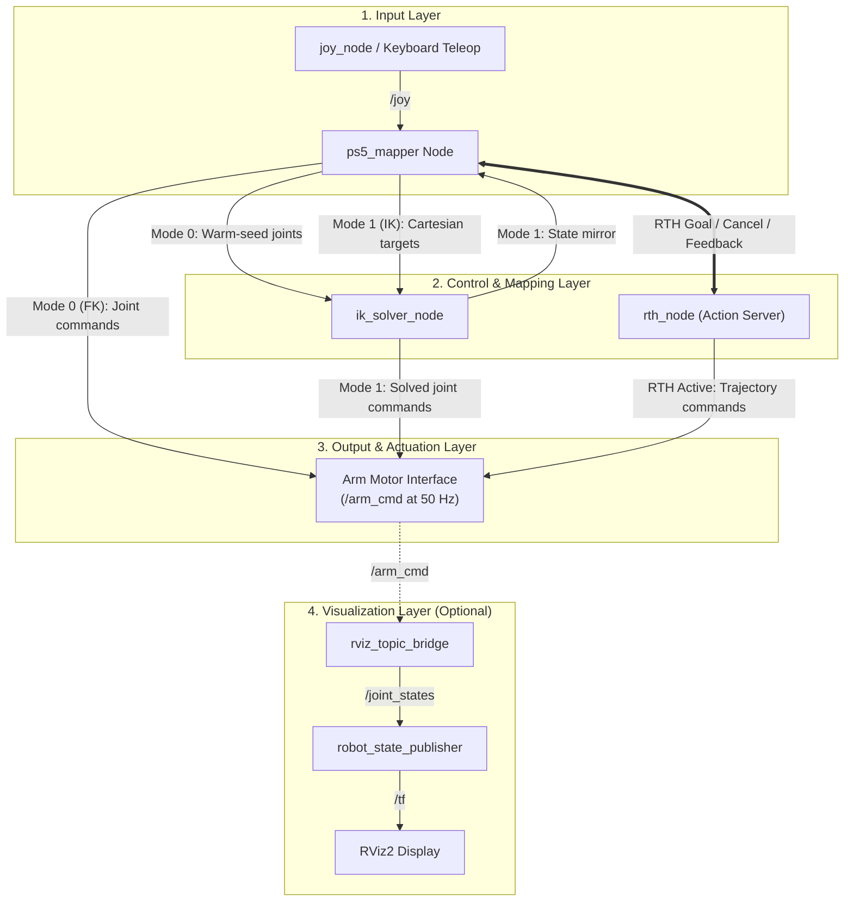

# 5-DOF Robotic Arm System


## 1. Package Overview

The repository is organized into four core packages:

- [**`arm_controller`**](./src/arm_controller): Contains the robot description (URDF / Xacro CAD model and meshes), MoveIt 2 configuration files (SRDF, kinematics, joint limits), visualization bridges, and the main launch file ([`arm.launch.py`](./src/arm_controller/launch/arm.launch.py)).
- [**`ik_motion_planner`**](./src/ik_motion_planner): Houses the C++ kinematic solver and motion nodes:
  - **`ik_solver_node`**: Solves 3-DOF inverse kinematics using the TRAC-IK solver and analytically levels the wrist relative to the ground.
  - **`rth_node`**: Action server providing automated, collision-checked Return-to-Home trajectory execution.
- [**`mapper`**](./src/mapper): Contains the main teleoperation node ([`ps5_mapper`](./src/mapper/src/ps5_mapper.py)) that translates controller and keyboard inputs into 50 Hz arm position commands, manages control modes, and enforces safety bounds.
- [**`arm_interfaces`**](./src/arm_interfaces): Defines custom ROS 2 interfaces, primarily the [`ReturnToHome.action`](./src/arm_interfaces/action/ReturnToHome.action) action definition.

---

## 2. Teleoperation Controls Guide

The arm supports both a **PlayStation 5 (DualSense) controller** and a **keyboard fallback**.

### 2.1. Operating Modes & Global Safety Controls

| Action | PS5 Controller | Keyboard Key | Description |
|---|---|---|---|
| **Toggle Mode (FK $\leftrightarrow$ IK)** | **OPTIONS** button | **`M`** | Switches between Forward Kinematics (joint-by-joint) and Inverse Kinematics (Cartesian reach/elevation). Transition is bumpless with zero jump. |
| **Return to Home (RTH)** | **SHARE** button | **`H`** | **1st press**: Automatically and smoothly returns the arm to its resting home position.<br>**2nd press**: Instantly cancels RTH and halts the arm where it stands. |
| **Emergency Stop / Lock** | **PS** button | **`X`** | Latches motion lock on/off. When active, all arm position commands are frozen in place. |
| **Precision Crawl Mode** | Hold **LB** (Left Bumper) | **`C`** (toggle) | Drops all arm movement speeds to **30%** for fine positioning. |
| **Orientation Layer Toggle** | Hold **RB** (Right Bumper) | **`R`** (toggle) | Shifts Right Stick control from arm positioning to wrist orientation. |
| **Stop / Center Axes** | Release sticks | **`SPACE`** | Centers stick inputs and stops moving. |

---

### 2.2. Mode 0: Forward Kinematics (FK Mode)
In FK mode, you control each individual joint angle directly.

- **Left Stick Left / Right** (`A` / `D`): Rotate **Base Yaw** (turntable left / right).
- **Left Stick Up / Down** (`W` / `S`): Pitch **Shoulder** (tilt upper arm forward / back).
- **Right Stick Up / Down** (`I` / `K`): Pitch **Elbow** (tilt forearm up / down).
- **With RB Held (Wrist Layer)**:
  - **Right Stick Up / Down** (`U` / `O`): Pitch **Wrist** (tilt wrist up / down).
  - **Right Stick Left / Right** (`J` / `L`): Roll **Wrist** (rotate wrist axially clockwise / counter-clockwise).

---

### 2.3. Mode 1: Inverse Kinematics (IK Mode)
In IK mode, the computer automatically coordinates all arm joints to move the arm tip smoothly through space using cylindrical coordinates.

- **Left Stick Left / Right** (`A` / `D`): **Base Azimuth** (orbit/sweep the arm left or right around the base).
- **Left Stick Up / Down** (`W` / `S`): **Radial Reach** (extend the arm outward or pull it inward in a straight line).
- **Right Stick Up / Down** (`I` / `K`): **Elevation** (raise or lower the arm vertically straight up and down).
- **With RB Held (Orientation Layer)**:
  - **Right Stick Up / Down**: **World Pitch** (tilt the wrist up or down relative to the ground horizon; the arm auto-levels as it moves).
  - **Right Stick Left / Right**: **Axial Roll** (spin the wrist roll joint).

---

### 2.4. On-the-Fly Speed Tuning (PS5 Controller Only)
You can increase or decrease joint and Cartesian speeds without restarting any nodes:

1. **Hold a Shape Button** to select the movement to trim:
   - Hold **CROSS ($\times$)**: Base Yaw (FK) / Azimuth (IK)
   - Hold **SQUARE ($\square$)**: Shoulder Pitch (FK) / Reach (IK)
   - Hold **CIRCLE ($\bigcirc$)**: Elbow Pitch (FK) / Elevation (IK)
   - Hold **TRIANGLE ($\triangle$)**: Wrist Pitch & Roll (FK/IK)
2. **Press Triggers** while holding the button:
   - Pull **RT** (Right Trigger): **Increase** speed (+0.02 rad/s or m/s).
   - Pull **LT** (Left Trigger): **Decrease** speed (-0.02 rad/s or m/s).

*(Note: The arm is temporarily locked while holding shape buttons to prevent accidental movement during speed adjustments).*

---

### 2.5. Built-In Operator Protections

- **Dominant-Axis Lock**: When moving a stick, the mapper locks onto your primary direction (horizontal or vertical) to eliminate accidental diagonal cross-talk. If you deliberately push strongly in the other direction, it smoothly transfers without getting stuck.
- **Dynamic Anti-Windup Leash**: In IK mode, the virtual target cannot drift more than 25 mm ahead of the physical arm. If you reach maximum extension and push forward, the command does not run away—pulling backward responds instantly with zero lag.
- **Signal-Loss Watchdog**: If communication with the controller drops for more than 0.2 seconds, the arm automatically holds its last commanded position.

---

## 3. System Architecture

The system uses a modular node network communicating over standard ROS 2 topics and actions:



### How the Data Flows:

1. **User Input**:
   - `joy_node` or `test_with_keyboard.py` reads user input and publishes controller states on `/joy`.
2. **Mapping & Control**:
   - `ps5_mapper` receives `/joy` messages and updates target positions at a steady 50 Hz.
   - In **FK Mode (Mode 0)**: The mapper calculates joint angles and publishes directly to the motor command topic `/arm_cmd`.
   - In **IK Mode (Mode 1)**: The mapper calculates Cartesian coordinates and sends them to `ik_solver_node`. The solver calculates the required joint angles using TRAC-IK and MoveIt, ensures the wrist stays level with the horizon, and outputs the resulting joints to `/arm_cmd`.
   - In **Return-to-Home**: The mapper sends an action goal to `rth_node`. The server checks the trajectory for joint limits and self-collisions, then streams a smooth step-by-step return trajectory directly to `/arm_cmd`.
3. **Actuation & Visualization**:
   - The physical arm motors listen on `/arm_cmd` for continuous 50 Hz position setpoints.
   - When launched with visualization (`rviz:=true`), `rviz_topic_bridge` copies `/arm_cmd` into `/joint_states`, allowing `robot_state_publisher` and `rviz2` to show the live arm pose.

---

## 4. Quick Start

### Launching the Complete System
To launch the full teleoperation system with RViz visualization:
```bash
ros2 launch arm_controller arm.launch.py rviz:=true
```

To launch headless on the robot hardware without visualizer overhead:
```bash
ros2 launch arm_controller arm.launch.py rviz:=false
```

### Keyboard Teleop Fallback
If testing without a physical DualSense controller:
```bash
ros2 run arm_controller test_with_keyboard.py
```
*(Press `Q` in the terminal to exit).*
