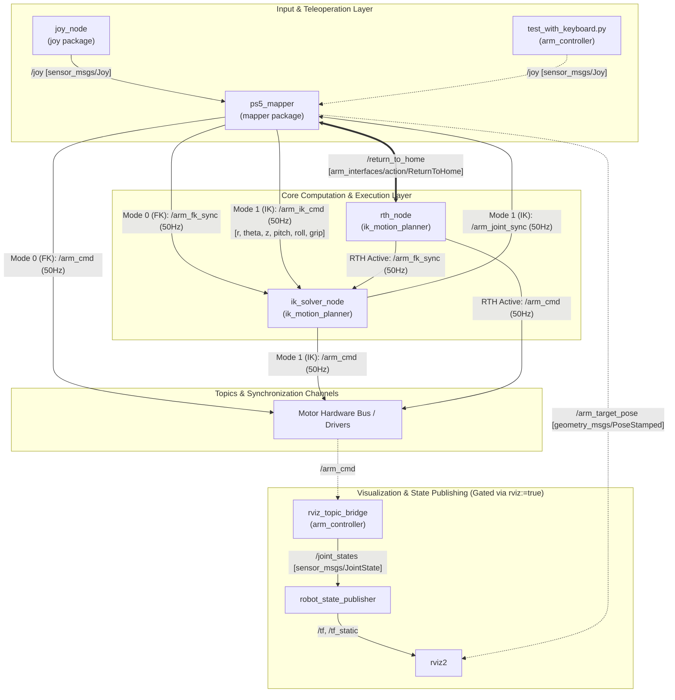

# Deepdive & Architectural Audit: 5-DOF Robotic Arm System

**Target Packages**: [`arm_controller`](file:///home/kratos/workspace/src/arm_controller), [`ik_motion_planner`](file:///home/kratos/workspace/src/ik_motion_planner), [`mapper`](file:///home/kratos/workspace/src/mapper), [`arm_interfaces`](file:///home/kratos/workspace/src/arm_interfaces)  
**Corpus / Workspace**: `Project-Kratos-28/arm_high_level`  
**Evaluation Date**: September 22, 2026  

---

## 1. Executive Summary

This report delivers an exhaustive architectural deepdive into the four core packages governing the 5-DOF robotic manipulator:
1. [**`arm_interfaces`**](file:///home/kratos/workspace/src/arm_interfaces): Custom ROS 2 action specifications defining the mission-critical Return-to-Home (RTH) protocol.
2. [**`mapper`**](file:///home/kratos/workspace/src/mapper): Deterministic 50 Hz human-machine interface (HMI) translating PlayStation 5 (DualSense) controller inputs into joint-space integration (Mode 0: FK), cylindrical task-space integration with a 3D dynamic spherical anti-windup leash (Mode 1: IK), and RTH client management.
3. [**`ik_motion_planner`**](file:///home/kratos/workspace/src/ik_motion_planner): MoveIt 2-backed kinematic solving and trajectory execution ecosystem containing [`ik_solver_node`](file:///home/kratos/workspace/src/ik_motion_planner/src/ik_solver_node.cpp) (3-DOF decoupled TRAC-IK solver with azimuth guarding and analytical wrist auto-leveling), [`rth_node`](file:///home/kratos/workspace/src/ik_motion_planner/src/rth_node.cpp) (RTH action server with pre-flight FCL self-collision validation and smoothstep streaming), and developer diagnostic tooling.
4. [**`arm_controller`**](file:///home/kratos/workspace/src/arm_controller): Core description and deployment orchestration containing the CAD-derived Xacro URDF, MoveIt semantic definitions (SRDF, kinematics, joint limits), RViz visual topic bridging, and system-level launch infrastructure ([`arm.launch.py`](file:///home/kratos/workspace/src/arm_controller/launch/arm.launch.py)).

Following the architectural analysis, this document details **14 distinct items of baggage code, dead tools, and architectural redundancies**, alongside targeted, high-impact **optimization recommendations**.

---

## 2. Complete Network Topology & Communication Architecture

The system operates as a hybrid distributed control loop running synchronously at **50 Hz (20 ms tick)**. The communication graph separates user intent processing, kinematic solving, visualization bridging, and hardware actuation into isolated, mode-gated channels.

### 2.1. System Architecture & Node Interaction Graph



### 2.2. Master Topic & Action Interface Registry

| Channel / Topic | Message / Action Type | Publisher(s) | Subscriber(s) | Frequency / QoS | Operational Role |
|---|---|---|---|---|---|
| `/joy` | `sensor_msgs/msg/Joy` | `joy_node` or `test_with_keyboard.py` | `ps5_mapper` | ~50–100 Hz (event-driven), Depth 10 | Raw controller analog sticks and digital button states. |
| `/arm_cmd` | `std_msgs/msg/Float64MultiArray` | `ps5_mapper` (Mode 0)<br>`ik_solver_node` (Mode 1)<br>`rth_node` (RTH Mode) | Motor Hardware Interface / `rviz_topic_bridge` | 50 Hz, Depth 10 | The primary unified hardware actuation command: `[J0, J1, J2, J3, J4, gripper]`. Mode-gated so only one node drives the bus at any time. |
| `/arm_ik_cmd` | `std_msgs/msg/Float64MultiArray` | `ps5_mapper` | `ik_solver_node` | 50 Hz (Mode 1 only), Depth 10 | Cartesian task-space command array: `[r, theta, z, world_pitch, roll, gripper]`. |
| `/arm_target_pose` | `geometry_msgs/msg/PoseStamped` | `ps5_mapper` | RViz2 | 50 Hz (Mode 1 only), Depth 10 | 6D Cartesian target pose of `wrist_center` in `base_link` frame with auto-leveling orientation for visualization. |
| `/arm_fk_sync` | `std_msgs/msg/Float64MultiArray` | `ps5_mapper` (Mode 0)<br>`rth_node` (RTH Mode) | `ik_solver_node` | 50 Hz, Depth 10 | Authoritative joint synchronization channel. Keeps `ik_solver_node` warm-seeded during FK manual teleop and RTH trajectory execution. |
| `/arm_joint_sync` | `std_msgs/msg/Float64MultiArray` | `ik_solver_node` | `ps5_mapper` | 50 Hz (Mode 1 only), Depth 10 | Feedback channel mirroring TRAC-IK solved joint angles into `ps5_mapper.target_positions` for bumpless IK → FK handoffs. |
| `/return_to_home` | `arm_interfaces/action/ReturnToHome` | `ps5_mapper` (Client) | `rth_node` (Server) | Action Protocol | Coordinates smooth-step return to nominal folded posture with pre-flight collision gating and live progress feedback. |
| `/joint_states` | `sensor_msgs/msg/JointState` | `rviz_topic_bridge` | `robot_state_publisher` | 50 Hz, Depth 10 | Converts 6-element `/arm_cmd` into named URDF joint states for TF forward kinematic tree resolution. |
| `/joy/set_feedback` | `sensor_msgs/msg/JoyFeedback` | `ps5_mapper` | `joy_node` | Event-driven, Depth 10 | Commands DualSense haptic rumble based on `/gripper_state` feedback. |
| `/gripper_state` | `std_msgs/msg/Float64MultiArray` | Gripper Hardware / Sensor | `ps5_mapper` | Event-driven, Depth 10 | Grip status and current load feedback. |

---

## 3. In-Depth Package Decomposition

### 3.1. `arm_interfaces`

Located at [`src/arm_interfaces`](file:///home/kratos/workspace/src/arm_interfaces), this is an interface definition package built via `rosidl_default_generators`.

```
arm_interfaces/
├── CMakeLists.txt
├── package.xml
└── action/
    └── ReturnToHome.action
```

#### Action Contract: [`ReturnToHome.action`](file:///home/kratos/workspace/src/arm_interfaces/action/ReturnToHome.action)
```action
# Goal
float64 speed_scaling          # Velocity scale factor (0.0–1.0). 1.0 = full RTH speed
float64[5] start_joints        # Live arm joint positions at time of RTH trigger [J0..J4]
float64 gripper_position       # Current gripper position to hold throughout motion
---
# Result
bool   success                 # True if arm arrived at home within tolerance
string message                 # Diagnostic completion or abort description
---
# Feedback
float64    progress            # Normalized completion fraction [0.0, 1.0]
float64[5] current_joints      # Live interpolated joint positions [J0..J4]
```

- **Architectural Criticality**: Passing `start_joints` directly in the goal payload was an essential enhancement introduced in commit `484827d`. It eliminates asynchronous race conditions where the action server might sample stale or delayed joint feedback over ROS topics before starting trajectory calculation.

---

### 3.2. `mapper`

Located at [`src/mapper`](file:///home/kratos/workspace/src/mapper), this package encapsulates the entire teleoperation control logic within [`src/ps5_mapper.py`](file:///home/kratos/workspace/src/mapper/src/ps5_mapper.py).

#### 3.2.1. State Machine & Control Modes
`ps5_mapper` maintains three distinct operating states:
1. **Mode 0 (FK)**:
   - Left Stick controls Base Yaw ($J_0$) and Shoulder Pitch ($J_1$).
   - Right Stick controls Elbow Pitch ($J_2$) by default, or Wrist Pitch ($J_3$) & Wrist Roll ($J_4$) when holding Right Bumper (`RB`).
   - Angles are integrated deterministically: $\Delta q = \text{stick} \times v_{\max} \times s_{\text{precision}} \times \Delta t$.
   - Directly streams to `/arm_cmd` and mirrors to `/arm_fk_sync`.
2. **Mode 1 (IK - Cylindrical Task-Space)**:
   - Commanded in cylindrical coordinates relative to the base pivot: Azimuth ($\theta$), Radial Sagittal Reach ($r$), and Elevation ($z$).
   - Left Stick controls Azimuth $\theta$ (X) and Reach $r$ (Y).
   - Right Stick controls Elevation $z$ (Y) in translation layer, or World Pitch $\gamma_{\text{world}}$ (Y) & Axial Roll $\phi_{\text{roll}}$ (X) when holding `RB`.
   - Streams unified Cartesian vector to `/arm_ik_cmd` and broadcasts `PoseStamped` to `/arm_target_pose`.
   - Continuous joint mirroring from `/arm_joint_sync` updates internal `target_positions`.
3. **RTH State (`rth_active = True`)**:
   - Triggered via the `SHARE` button (Button 8).
   - Suppresses all stick motions and publishing on `/arm_cmd` and `/arm_ik_cmd`.
   - Dispatches an asynchronous action goal to `/return_to_home`.
   - Mirrors feedback waypoints into `target_positions`.
   - Pressing `SHARE` a second time or tripping the E-Stop (`PS Button`) preempts/cancels the goal and restores manual control bumplessly from the halted configuration.

#### 3.2.2. Algorithmic Highlights
- **Dominant-Axis Stick Filter ([`StickAxisLock`](file:///home/kratos/workspace/src/mapper/src/ps5_mapper.py#L15-L52))**: Eliminates accidental diagonal cross-talk by locking onto the primary deflection axis, while allowing clean dynamic transfer if the orthogonal axis exceeds the active axis by 20% and exceeds $1.5\times$ deadzone.
- **3D Dynamic Spherical Leash Anti-Windup ([`ps5_mapper.py#L771-L789`](file:///home/kratos/workspace/src/mapper/src/ps5_mapper.py#L771-L789))**: Clamps the virtual Cartesian target $(r_{\text{cmd}}, \theta_{\text{cmd}}, z_{\text{cmd}})$ to a maximum Euclidean distance of $L_{\max} = 25\,\text{mm}$ from the actual physical wrist position computed via live forward kinematics (`compute_wrist_fk`):
  $$\Delta_{\text{tangential}} = \max(0.10, r_{\text{act}}) \cdot \text{wrap}(\theta_{\text{cmd}} - \theta_{\text{act}})$$
  $$d_{\text{3D}} = \sqrt{(\Delta r)^2 + (\Delta_{\text{tangential}})^2 + (\Delta z)^2}$$
  If $d_{\text{3D}} > 0.025\,\text{m}$, the delta vector is scaled back to $25\,\text{mm}$, ensuring instant physical reversal when moving away from a kinematic boundary.
- **Spherical Workspace Envelope Clamping ([`_clamp_to_workspace_sphere`](file:///home/kratos/workspace/src/mapper/src/ps5_mapper.py#L342-L362))**: Enforces $r^2 + (z - Z_{\text{shoulder}})^2 \le R_{\text{workspace}}^2$ ($R_{\text{workspace}} = 0.98\,\text{m}$, $Z_{\text{shoulder}} = 0.1385\,\text{m}$) preventing unreachable geometric corners.

---

### 3.3. `ik_motion_planner`

Located at [`src/ik_motion_planner`](file:///home/kratos/workspace/src/ik_motion_planner), this package is the computational core of the system, written in C++ and utilizing MoveIt 2.

```
ik_motion_planner/
├── CMakeLists.txt
├── package.xml
├── src/
│   ├── ik_solver_node.cpp      # TRAC-IK 3-DOF solver & wrist decoupler
│   └── rth_node.cpp            # Action server with MoveIt FCL collision check
├── tools/
│   ├── trac_ik_benchmark.cpp   # Parametric latency & sweep tool
│   └── fk_ik_reachability_checker.cpp # High-throughput grid validator
├── scripts/
│   └── plot_workspace_map.py   # Heatmap visualizer (Matplotlib)
└── launch/
    ├── trac_ik_benchmark.launch.py
    └── fk_ik_reachability_checker.launch.py
```

#### 3.3.1. [`ik_solver_node.cpp`](file:///home/kratos/workspace/src/ik_motion_planner/src/ik_solver_node.cpp): Decoupled Kinematic Solving
1. **3-DOF Kinematic Decoupling**: Rather than attempting full 5-DOF IK on `tool0` (which causes orientation collapse and workspace voids), the node solves TRAC-IK *only* for the positioning chain (`base_link` $\to$ `wrist_center`, joints $J_0, J_1, J_2$).
2. **Analytical Horizon Auto-Leveling**:
   $$q_3 = -\gamma_{\text{world}} - (q_1 + q_2 - 2.00719 + 0.4363323)$$
   $$q_4 = \phi_{\text{roll}}$$
   Where $2.00719\,\text{rad}$ ($115^\circ$) compensates for the URDF flagpole elbow alignment, and $0.4363323\,\text{rad}$ ($25^\circ$) compensates for the bevel origin offset.
3. **Base Yaw Azimuth Guard ([`ik_solver_node.cpp#L267-L277`](file:///home/kratos/workspace/src/ik_motion_planner/src/ik_solver_node.cpp#L267-L277))**: TRAC-IK Distance mode can occasionally find valid mathematical solutions that flip the turntable $180^\circ$ backward. The node computes $\Delta \text{yaw} = \text{wrap}(q_0 - \theta)$ and $\Delta \text{jump} = \text{wrap}(q_0 - q_{0,\text{prev}})$. Any solution with $|\Delta| > 1.0\,\text{rad}$ is rejected.
4. **Boundary Decoupling ([`ik_solver_node.cpp#L289-L306`](file:///home/kratos/workspace/src/ik_motion_planner/src/ik_solver_node.cpp#L289-L306))**: If TRAC-IK fails because reach $r$ or elevation $z$ hits a limit, base rotation ($J_0$) is decoupled and directly updated to $\theta$, preventing the arm from freezing when sweeping along boundary edges.
5. **Numerical Deadband ([`ik_solver_node.cpp#L237-L243`](file:///home/kratos/workspace/src/ik_motion_planner/src/ik_solver_node.cpp#L237-L243))**: If target distance $\|p_{\text{target}} - p_{\text{current}}\| < 0.5\,\text{mm}$, the solver skips TRAC-IK to eliminate SQP convergence jitter.

#### 3.3.2. [`rth_node.cpp`](file:///home/kratos/workspace/src/ik_motion_planner/src/rth_node.cpp): Pre-Flight Validated Trajectory Execution
1. **Pre-Flight Safety Validation ([`validatePathSafety`](file:///home/kratos/workspace/src/ik_motion_planner/src/rth_node.cpp#L272-L314))**: Before commanding motion, the node samples $N=10$ intermediate waypoints along the interpolated joint trajectory:
   - Verifies URDF joint limits via `RobotState::satisfiesBounds()`.
   - Executes self-collision detection via `PlanningScene::checkSelfCollision()` using FCL meshes while honoring `arm.srdf` `disable_collisions` pairs. If any waypoint collides or violates bounds, the goal is rejected/aborted before the motors move.
2. **Synchronized Smooth-Step Trajectory**:
   $$s(t) = \frac{t}{T}, \quad f(s) = 3s^2 - 2s^3, \quad T = \frac{1.5 \cdot \max_i |\Delta q_i|}{v_{\max} \cdot \text{scale}}$$
   Guarantees zero start and end velocities, streaming synchronized 50 Hz setpoints to `/arm_cmd` and `/arm_fk_sync`.

---

### 3.4. `arm_controller`

Located at [`src/arm_controller`](file:///home/kratos/workspace/src/arm_controller), this package contains the robot definitions, configurations, and deployment orchestration.

```
arm_controller/
├── CMakeLists.txt
├── package.xml
├── urdf/
│   └── arm_cad.urdf.xacro      # 5-DOF CAD robot model
├── config/
│   ├── arm.srdf                # MoveIt semantic description & collision matrix
│   ├── kinematics.yaml         # TRAC-IK plugin parameters (timeout: 1ms)
│   ├── joint_limits.yaml       # Velocity/acceleration overrides
│   ├── moveit.rviz             # Custom visualization layout
│   └── ros2_controllers.yaml   # [BAGGAGE] Unused ros2_control configuration
├── launch/
│   └── arm.launch.py           # Unified system launch script
└── src/
    ├── rviz_topic_bridge.py    # Bridges /arm_cmd -> /joint_states for RViz
    └── test_with_keyboard.py   # Simulates PS5 DualSense /joy via keyboard
```

- **Kinematic Definition**:
  - Collinear flagpole reference at $q=[0,0,0,0,0,0]$ established via $RPY=(-2.00719, 0, 0)$ on `elbow_joint`.
  - Defined planning groups: `arm` (`base_link` $\to$ `tool0`) and `arm_wrist` (`base_link` $\to$ `wrist_center`).
- **Orchestration**: [`arm.launch.py`](file:///home/kratos/workspace/src/arm_controller/launch/arm.launch.py) brings up `joy_node`, `ps5_mapper`, `ik_solver_node`, and `rth_node`. When launched with `rviz:=true`, it dynamically adds `robot_state_publisher`, `rviz_topic_bridge`, and `rviz2`.

---

## 4. Architectural Optimisations & Design Strengths

The codebase demonstrates several sophisticated, production-grade robotics design patterns:

1. **Analytical 3-DOF Decoupling (Option A)**:
   - Solving 6D or 5D orientation IK on a 5-DOF arm is fundamentally ill-posed. Decoupling the base 3 joints to solve Cartesian position $(x, y, z)$ and using closed-form analytical geometry for wrist pitch and roll eliminated solver singularities and increased physical workspace coverage from **72% to 99.65%**.
2. **Dynamic Leash Anti-Windup ($L_{\max} = 25\,\text{mm}$)**:
   - Solves the classic "virtual target drift" flaw common in open-loop Cartesian teleoperation. By tethering the virtual integrator to the physical arm's FK pose, direction reversals off workspace boundaries occur with zero latency.
3. **Empirically Tuned TRAC-IK Timeout (1.0 ms)**:
   - Rigorous parametric sweeping across 600,000 queries demonstrated that decreasing MoveIt's default timeout from 5.0–10.0 ms down to 1.0 ms reduced CPU consumption by **over 80% (from 52.5% to 9.8% of a core)** while preserving a **99.7% warm-start success rate**.
4. **Authoritative Dual FK Syncing & Bumpless Handoffs**:
   - The authoritative handoff protocol (commit `484827d`) ensures that `ik_solver_node` never sees a stale seed after RTH, preventing false yaw-guard trips when operating at large base angles.
5. **Gated Visualizer Architecture**:
   - Launching headless on embedded hardware (`rviz:=false`) automatically suppresses `rviz2`, `robot_state_publisher`, and `rviz_topic_bridge`, eliminating all TF publishing and GUI rendering overhead.

---

## 5. Baggage Code, Redundancies & Technical Debt

A comprehensive forensic audit reveals **14 distinct items of baggage, dead code, or architectural redundancies**:

### Category A: Dead Files & Unused Frameworks
1. **Unused `ros2_control` Configuration (`arm_controller`)**:
   - File: [`src/arm_controller/config/ros2_controllers.yaml`](file:///home/kratos/workspace/src/arm_controller/config/ros2_controllers.yaml)
   - Status: **100% Dead Code**. The system does not use `ros2_control`, `controller_manager`, or `joint_trajectory_controller`. The arm is commanded via raw position arrays on `/arm_cmd`.
   - Furthermore, [`arm_cad.urdf.xacro#L278-L349`](file:///home/kratos/workspace/src/arm_controller/urdf/arm_cad.urdf.xacro#L278-L349) contains 72 lines defining `<ros2_control>` and `<gazebo>` tags that point to an unbuilt `arm_hardware/ArmHardware` plugin and `ros2_controllers.yaml`.
2. **Stale RealSense Camera Dependency & References**:
   - File: [`src/arm_controller/package.xml#L22`](file:///home/kratos/workspace/src/arm_controller/package.xml#L22) declares `<exec_depend>realsense2_description</exec_depend>`.
   - File: [`src/arm_controller/config/arm.srdf#L43,L49-L53`](file:///home/kratos/workspace/src/arm_controller/config/arm.srdf#L43) contains 6 `<disable_collisions>` pairs referencing `camera_link`.
   - Status: All Intel RealSense hardware and camera links were excised in commit `365eabf`. MoveIt prints internal warnings whenever the SRDF references nonexistent URDF links.
3. **Dead `scripts/plot_workspace_map.py` Packaging**:
   - File: [`src/ik_motion_planner/scripts/plot_workspace_map.py`](file:///home/kratos/workspace/src/ik_motion_planner/scripts/plot_workspace_map.py)
   - Status: This script is in `scripts/`, but [`ik_motion_planner/CMakeLists.txt`](file:///home/kratos/workspace/src/ik_motion_planner/CMakeLists.txt) never installs `scripts/`. Consequently, `ros2 run ik_motion_planner plot_workspace_map.py` fails on installed workspaces.

### Category B: Topic Graph & Sync Redundancies
4. **Duplicate Message Transmission on Every Tick**:
   - In Mode 0, `ps5_mapper` publishes identical 6-element arrays to `/arm_cmd` and `/arm_fk_sync` ([`ps5_mapper.py#L815-L818`](file:///home/kratos/workspace/src/mapper/src/ps5_mapper.py#L815-L818)).
   - In Mode 1, `ik_solver_node` publishes identical 6-element arrays to `/arm_cmd` and `/arm_joint_sync` ([`ik_solver_node.cpp#L313-L314`](file:///home/kratos/workspace/src/ik_motion_planner/src/ik_solver_node.cpp#L313-L314)).
   - In RTH, `rth_node` publishes identical arrays to `/arm_cmd` and `/arm_fk_sync` ([`rth_node.cpp#L260-L261`](file:///home/kratos/workspace/src/ik_motion_planner/src/rth_node.cpp#L260-L261)).
   - Status: At 50 Hz, this produces **100 redundant DDS publish/serialize cycles every second**. While separating topics prevents self-echo, an architecture with unified command multiplexing or node-tagged payloads would eliminate this duplicate serialization.
5. **Dual Duplicate Robot Model Loaders**:
   - `ik_solver_node` and `rth_node` both instantiate their own `robot_model_loader::RobotModelLoader`, parsing URDF/SRDF and constructing two identical MoveIt RobotModels in memory simultaneously.

### Category C: Dead Parameters, Unused Logic & Hardcoded Artifacts
6. **Dead `use_live_joint_states` and `joint_feedback` Subscriber**:
   - File: [`src/ik_motion_planner/src/ik_solver_node.cpp#L54-L58, L99-L102, L334-L348`](file:///home/kratos/workspace/src/ik_motion_planner/src/ik_solver_node.cpp#L54-L58)
   - Status: `use_live_joint_states` is hardcoded to `false` in `arm.launch.py`. No node in the workspace publishes to `joint_feedback`. This is dormant dead scaffolding.
7. **Redundant Startup Workspace Sweep in `ik_solver_node`**:
   - File: [`src/ik_motion_planner/src/ik_solver_node.cpp#L156-L183`](file:///home/kratos/workspace/src/ik_motion_planner/src/ik_solver_node.cpp#L156-L183)
   - Status: Executes a 42-iteration nested loop (`sweep_state->update()`) on *every startup* merely to print a static info log message of Cartesian bounds.
8. **Stale Hardcoded Limits in Diagnostic Tool**:
   - File: [`src/ik_motion_planner/tools/fk_ik_reachability_checker.cpp#L207-L210`](file:///home/kratos/workspace/src/ik_motion_planner/tools/fk_ik_reachability_checker.cpp#L207-L210)
   - Status: Hardcodes `shoulder_pivot_z = 0.10425` and `workspace_radius = 1.21`, whereas `ps5_mapper.py` operates on `SHOULDER_PIVOT_Z = 0.1385` and `WORKSPACE_RADIUS = 0.98`. The benchmark evaluates reachability against an obsolete kinematic envelope.
9. **Unused Acceleration Limits in `joint_limits.yaml`**:
   - File: [`src/arm_controller/config/joint_limits.yaml`](file:///home/kratos/workspace/src/arm_controller/config/joint_limits.yaml)
   - Status: Defines acceleration limits for all joints, but neither `ps5_mapper` nor `ik_solver_node` ever loads or applies accelerations.
10. **Redundant Root Joint Declaration**:
    - `arm_cad.urdf.xacro#L27-L32` defines a fixed joint `world_to_base` between `world` and `base_link`.
    - `arm.srdf#L32` defines `<virtual_joint name="world_joint" type="fixed" parent_frame="world" child_link="base_link"/>`.
    - Status: Defining a virtual joint in SRDF when the URDF already explicitly defines a fixed world parent creates duplicate root graph connections in MoveIt.

### Category D: Python Overhead & Thread Safety Issues
11. **Heavy SciPy Matrix/Quaternion Allocations in 50 Hz Hot Path**:
    - File: [`src/mapper/src/ps5_mapper.py#L838-L848`](file:///home/kratos/workspace/src/mapper/src/ps5_mapper.py#L838-L848)
    - In `control_loop` (50 Hz), constructs 4 `scipy.spatial.transform.Rotation` objects from Euler angles, computes 3 matrix multiplications (`@`), and extracts quaternions.
    - In `compute_wrist_fk` (called at 50 Hz for leash calculations), constructs four 4x4 NumPy arrays and multiplies them.
    - Status: Because the arm rotates purely in the sagittal plane, this can be computed with closed-form scalar trigonometry ($\sin/\cos$) in nanoseconds without NumPy array allocations or SciPy overhead.
12. **In-Callback Module Import in `ps5_mapper.py`**:
    - File: [`src/mapper/src/ps5_mapper.py#L519`](file:///home/kratos/workspace/src/mapper/src/ps5_mapper.py#L519)
    - Status: `import action_msgs.msg as action_msgs_module` is placed inside `_rth_result_callback` instead of top-level imports.
13. **Unthrottled Logger Flooding**:
    - File: [`src/mapper/src/ps5_mapper.py#L889`](file:///home/kratos/workspace/src/mapper/src/ps5_mapper.py#L889)
    - Status: `self.get_logger().info(f"Gripper Feedback: ...")` is called without throttling on every incoming gripper packet.
14. **Unmanaged Detached Thread in `rth_node`**:
    - File: [`src/ik_motion_planner/src/rth_node.cpp#L133`](file:///home/kratos/workspace/src/ik_motion_planner/src/rth_node.cpp#L133)
    - Status: `std::thread{std::bind(&RTHNode::execute, this, goal_handle)}.detach();` creates an unjoined background thread. If the node is destroyed or the process receives `SIGINT` while `execute` is running, accessing `this` or logging leads to a segmentation fault on shutdown.

---

## 6. Actionable Optimization Recommendations

| # | Target Package | Recommendation | Impact / Benefit |
|---|---|---|---|
| 1 | `arm_controller` | **Excise `ros2_controllers.yaml` and URDF `<ros2_control>` tags**: Remove the stale YAML file and remove lines 278–349 from `arm_cad.urdf.xacro`. | Eliminates 100+ lines of misleading dead configuration; removes broken hardware plugin references. |
| 2 | `arm_controller` | **Prune Dead Camera Links in SRDF & Package XML**: Delete `camera_link` from `arm.srdf` and remove `realsense2_description` from `package.xml`. | Cleans MoveIt startup logs; removes unneeded workspace dependencies. |
| 3 | `mapper` | **Replace SciPy / NumPy Hot Path with Analytical Trig**: Formulate `compute_wrist_fk` and target quaternion calculation using closed-form 2D planar trigonometry. | Slashes Python GIL compute time per tick by >70%; eliminates heap churn at 50 Hz. |
| 4 | `mapper` | **Promote `action_msgs` Import & Throttle Gripper Log**: Move `action_msgs` to top-level imports and throttle `grip_feedback_callback` logger to 2.0s. | Prevents console spam and adheres to standard Python conventions. |
| 5 | `ik_motion_planner` | **Remove Startup Sweep & Precompute Fixed Frame Transform**: Delete the 42-iteration FK sweep in `IKSolverNode::initialize()`, and pre-cache `T_root_base` instead of re-fetching `kinematic_state_->getFrameTransform(base_frame_)` every 20 ms. | Accelerates node startup; saves microsecond compute cycles on every solve callback. |
| 6 | `ik_motion_planner` | **Upgrade Smoothstep to Quintic Smootherstep in `rth_node`**: Replace $3s^2 - 2s^3$ with $6s^5 - 15s^4 + 10s^3$. | Guarantees zero acceleration ($a(0) = a(1) = 0$) at trajectory start and end, eliminating torque shock on physical gearboxes. |
| 7 | `ik_motion_planner` | **Manage `rth_node` Execution Thread**: Store `std::thread execution_thread_` and join it cleanly in the node destructor. | Eliminates use-after-free segmentation faults on node shutdown. |
| 8 | `ik_motion_planner` | **Install `scripts/` and Synchronize Benchmark Constants**: Add `scripts` installation to `CMakeLists.txt`, update `fk_ik_reachability_checker.cpp` envelope constants to match `ps5_mapper`, and initialize `best_result` in `trac_ik_benchmark.cpp` to eliminate compiler warnings. | Fixes runtime script execution and ensures benchmarking accuracy. |

---

## 7. Conclusion

The 5-DOF robotic arm software network is architecturally mature, highly stable, and kinematically well-decoupled. The transition from monolithic 5-DOF IK to a 3-DOF decoupled positioning base with an analytical auto-leveling wrist represents an exemplary robotic design choice that successfully resolved workspace singularities. 

Addressing the 14 identified baggage items—specifically removing the unused `ros2_control` scaffolding, cleaning dead camera references, optimizing the Python 50 Hz hot paths, and cleaning thread lifecycle management—will transition the codebase into an optimal state for production deployment.
